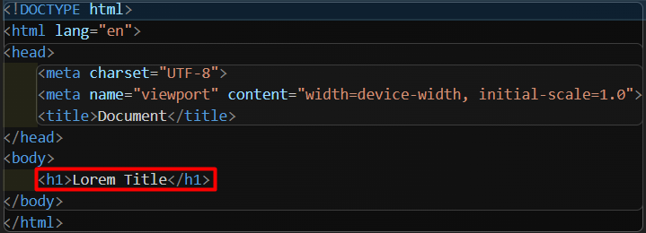
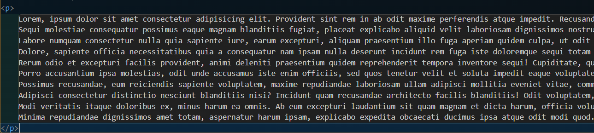
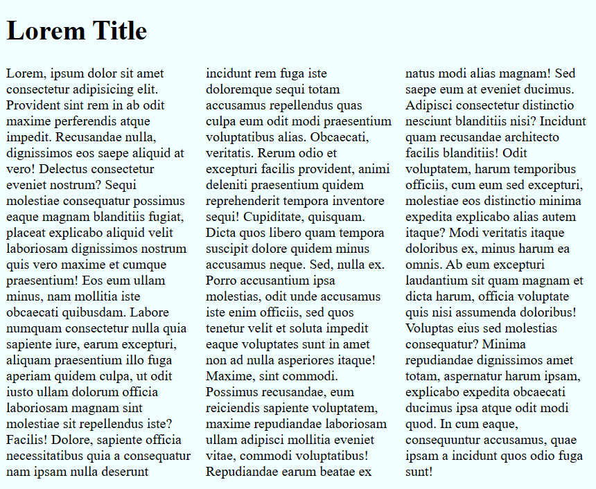
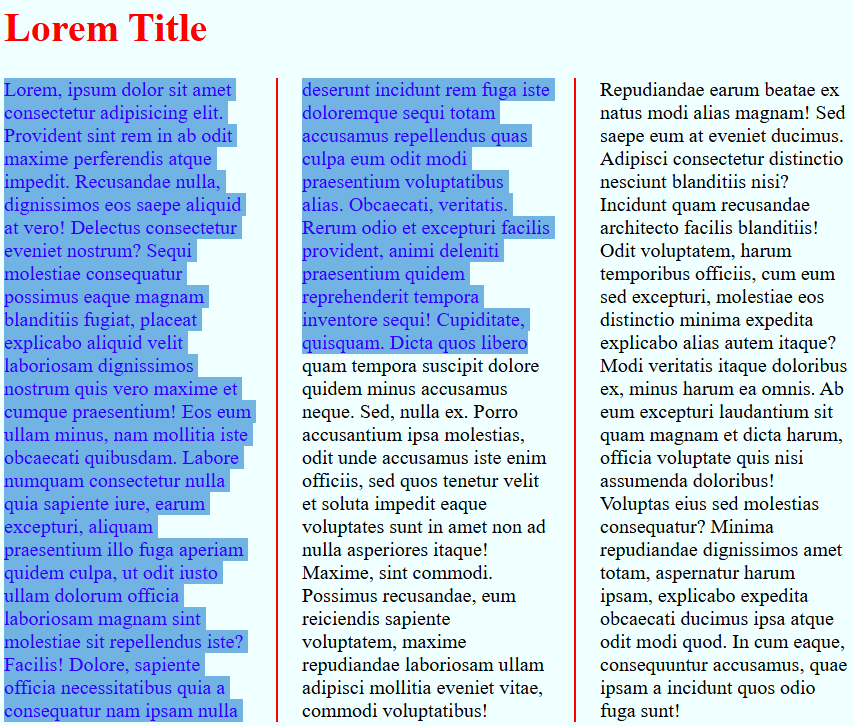

1▪ Define un background color para el HTML  
```html{background-color: azure;}```

2▪ Define un titulo principal  


3▪ Realiza un lorem*10 dentro de un elemento P  
```<p>Lorem*10</p>```


4▪ Haz que se párrafo se visualice en 3 columnas  
```p{column-count: 3;}```


5▪ Cuando nos situemos sobre el H1 queremos que el color del texto cambie.  
```h1:hover{color: red;}```

6▪ Cuando seleccionemos el texto del párrafo, queremos que cambie el background y el color del texto  
```p::selection{background-color: rgb(113, 179, 226); color: rgb(51, 0, 255);}```

7▪ La separación entre columnas deberá de ser de 40px  
```p{column-gap: 40px;}```

8▪ Finalmente, define una regla que separé a cada una de las columnas de 2px y que sea roja  
```p{column-rule-width: 2px;column-rule-color: red;column-rule-style: solid;}```
